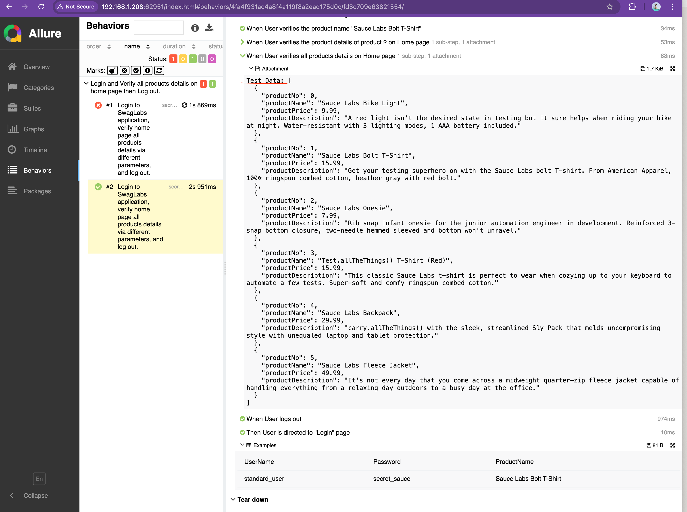
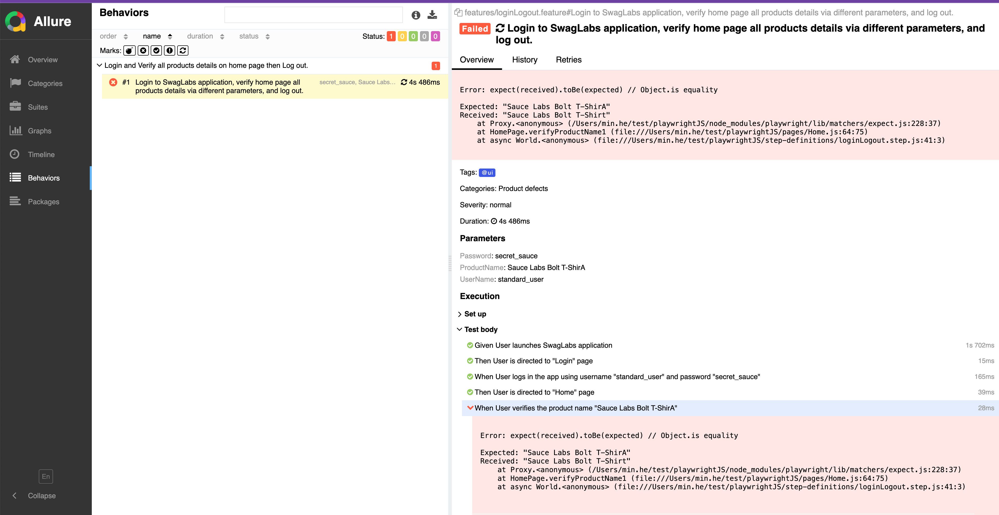
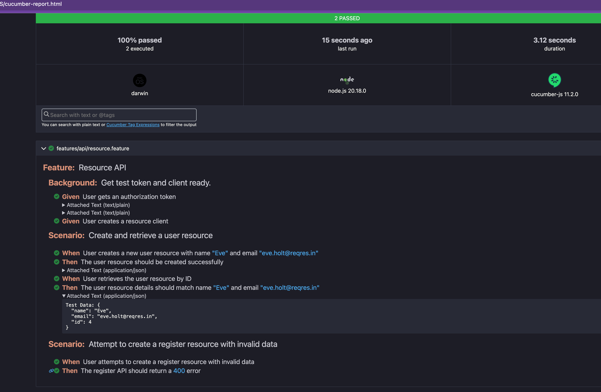
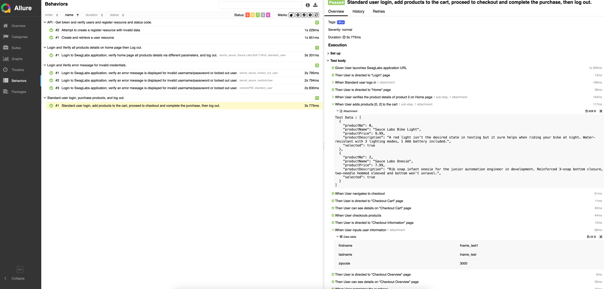

<h1> Playwright Automation Framework with CucumberJS & Allure Reporting</h1>

This repository contains an automation framework built using <strong>Playwright</strong>, <strong>JavaScript (ESM)</strong>, <strong>CucumberJS</strong>, and <strong>Allure reporting</strong> for <strong>E2E</strong> testing web applications.

This is still an ongoing project, current purpose is for skills pickup and demonstration. Play Playwright with Cucumber(BDD) which is using cucumber runner now, try to cover passing test data via different ways: cucumber step argument, data table, csv file; support dynamic page creation, dynamic getLocators ...... will add more features soon, like accessibility testing... 

Playright test runner related details please refer here - [README.md](./playwrightTestRunner/README.md)

Project structure:
<ul>
├── api
├── configs
├── data
├── features
│   ├── api
│   └── e2e
├── pages
└── step-definitions
    ├── api
    ├── e2e
</ul>
 

<h2> Notes for test scenarios </h2>
<h3> 1. Browser (UI) Tests </h3>
<h4>Scenario1 - Login Test: Validate that a user can log in successfully with valid credentials
and that an error message is displayed for invalid credentials by iterations.</h4>

<h4>Scenario2 - Product Purchase Test: Validate the end-to-end purchase process:</h4>
<ul>
Log in -> Add a product to the cart. -> Proceed to checkout and complete the purchase. -> Log out.
</ul>

<h3> 2. API Tests (via axios) </h3>
<h4>Scenario1 - Get token and verify users and register resource and status code.</h4>
<ul>
Obtain an authorization token. -> Use API do a POST request to create a record. -> Use API GET request to retrieve the record you added, and verify retrived record.
</ul>
<h4>Scenario2 - Attempt to create a register resource with invalid data.</h4>
<ul>
Use API attempt to do a POST request. -> Verify that the response contains an error messagen.
</ul>

<h2> Prerequisites </h2>

Ensure that you have the following installed:

    
 Node.js (version >=14) 

    
 npm is recommended 

<h2> Setup </h2>
<h3> 1. Clone the Repository and Install Dependencies </h3>
Run the following command to install all the required dependencies:
    npm install

<h3> 2. Configuration </h3>
Cucumber Configuration (cucumber.mjs): This file contains configurations specific to Cucumber, such as the location of feature files and the step definition files.

<h3> 3. Configure Allure Reporting</h3>
To generate Allure reports after the tests run, make sure you <strong>have Allure installed globally</strong> or you can install it via npm install -g allure-commandline.

<h3> 4. Running Tests</h3>
You can run your tests using the following commands:

    npm run test
*This will:
    Run the <strong>E2E</strong> tests using CucumberJS.
    Generate the Allure report results inside the allure-results/ directory.

    npm run test:local
*This will:
    Run the <strong>E2E</strong> tests using CucumberJS.
    Generate the cucumber html report results with console progress information, cucumber-report.html inside the project root directory.

    npm run test:api
*This will:
    Run the <strong>API</strong> tests only using CucumberJS.
    Generate the Allure report results inside the allure-results/ directory.

     npm run test:local -- --tags @debug   
*This will:
    Run the <strong>API</strong> tests with <strong>tag - @debug</strong> only using CucumberJS.
    Generate the Allure report results inside the allure-results/ directory.

<h3> 5. Viewing the Allure Report (Optional) </h3>
After running the tests, you can generate and view the Allure report by running the following command:
    npm run report
This will open a web server and display the Allure report in your browser.

<h2> Screenshots </h2>

### [Passed Allure Result](screenshots/allure_1.png)

### [Failed Allure Result](screenshots/allure_2.png)

### [API Cucumber Result](screenshots/api_cucumber_2.png)

### [All Allure Result](screenshots/allure_all.png)

More snapshots could be found under screenshots folder for more reference.
