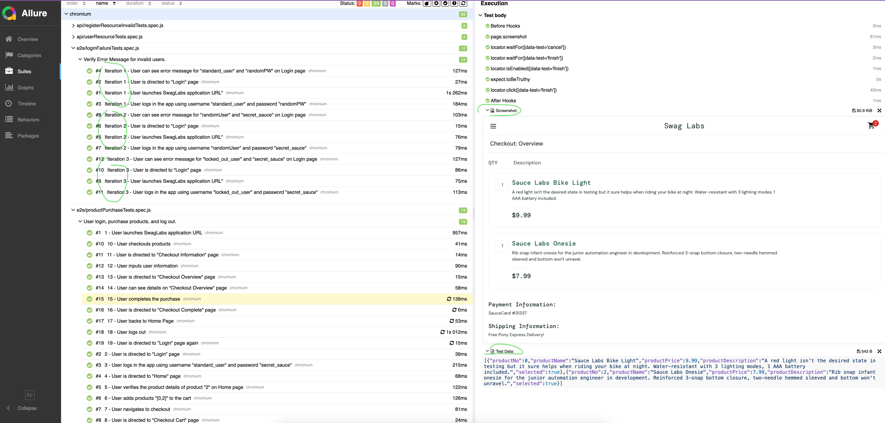
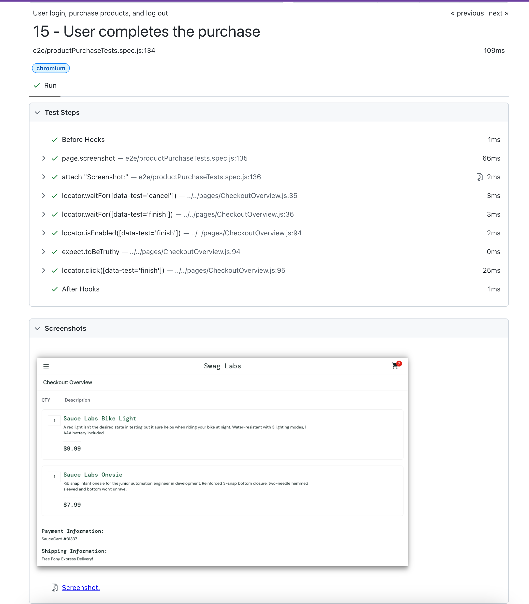
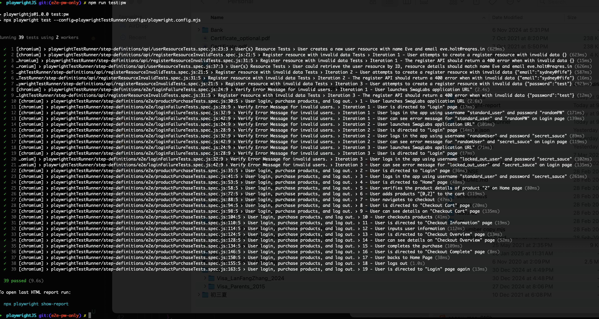

<h1> Playwright Only Automation Framework with Allure Reporting</h1>

This repository contains an automation framework built using <strong>Playwright</strong>, <strong>JavaScript (ESM)</strong>, and <strong>Allure reporting</strong> for <strong>E2E</strong> and <strong>API</strong> testing web applications.

This is still an ongoing project, current purpose is for skills pickup and demonstration. Play playwright without Cucumber(BDD) which is using playwright test runner (under DIR <project root>/playwrightTestRunner) which is sharing the same POM (under DIR <project root>/pages ) whith playwright + cuccumber framework.

Project structure:
<ul>
├── configs - shared env configs with playwright + cucumber framework.
│   ├── config.api.json
│   ├── config.default.json
├── data - shared data with playwright + cucumber framework.
├── pages --- shared page object model with playwright + cucumber framework.
├── playwrightTestRunner --- Only for playwright test runner.
│   ├── README.md
│   ├── configs
│   └── step-definitions
</ul>

<h2> Notes for test scenarios </h2>
<h3> 1. Browser (UI) Tests </h3>
<h4>Scenario1 - Login Test: Validate that a user can log in successfully with valid credentials
and that an error message is displayed for invalid credentials by iterations.</h4>

<h4>Scenario2 - Product Purchase Test: Validate the end-to-end purchase process:</h4>
<ul>
Log in -> Add a product to the cart. -> Proceed to checkout and complete the purchase. -> Log out.
</ul>

<h3> 2. API Tests (via playwright APIRequestContext - request fixture) </h3>
<h4>Scenario1 - Get token and verify users and register resource and status code.</h4>
<ul>
Obtain an authorization token. -> Use API do a POST request to create a record. -> Use API GET request to retrieve the record you added, and verify retrived record.
</ul>
<h4>Scenario2 - Attempt to create a register resource with invalid data.</h4>
<ul>
Use API attempt to do a POST request. -> Verify that the response contains an error messagen(via iterations).
</ul>

<h2> Run Tests</h2>
You can run your tests using the following commands:

    npm run test:pw
*This will:
    Run the <strong>playwright </strong> tests using playwright test runner.
    Generate the Allure report results inside the allure-results/ directory.
    Generate the Playwright html report results inside the test-results/ directory.

<h2> View Report (Optional) </h2>
<h3> a. Viewing the Allure Report (Optional) </h3>
After running the tests, you can generate and view the Allure report by running the following command:
    npm run report
This will open a web server and display the Allure report in your browser.

<h3> b. Viewing the Playwright Report (Optional) </h3>
After running the tests, you can generate and view the Playwright report by running the following command:
    npx playwright show-report
This will open a web server and display the Playwright report in your browser.

<h2> Screenshots </h2>

### [Playwright Test Runner Allure Result](../screenshots/PlaywrightTestRunner_allure.png)

### [Playwright Test Runner HTML Result](../screenshots/PlaywrightTestRunner_html.png)

### [Playwright Test Runner List Result](../screenshots/PlaywrightTestRunner_list.png)

More snapshots could be found under screenshots folder for more reference.
